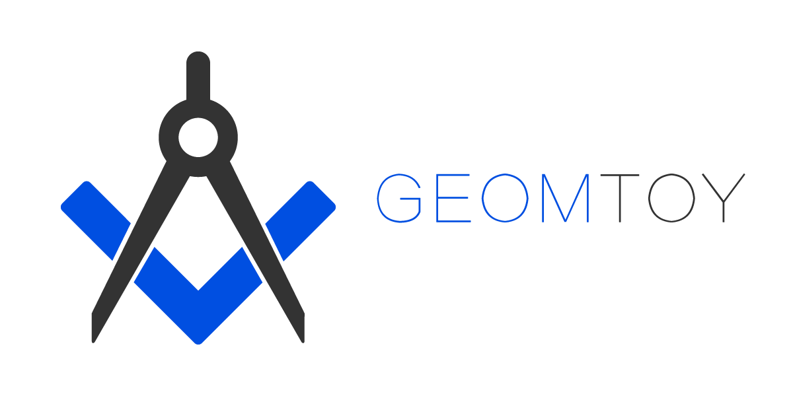
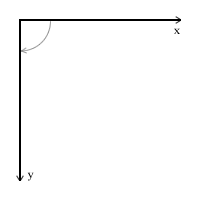
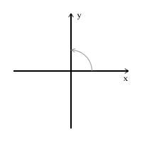

# Geomtoy

<p align="center" width="100%">
    
</p>

> A 2D geometry responsive computing, visualizing and interacting library.

## Install

```js
npm i geomtoy -S
```

## Usage

```javascript
let g = new Geomtoy({...options}),
    p1 = g.Point(1, 0),
    l1 = g.Line(1, 0, 0),
    c1 = g.Circle(10, p1)

console.log(p1.getDistanceFrom(l1))
console.log(p1.)

//shortcut
let distance = g.Point(100,120).getDistanceFrom(g.Point(20,30))
```

## Docs
- [Docs](./docs/modules.md)
 

## Features
- Supply a collection of commonly used 2D geometric objects.
- Support commonly used geometric computing, like `intersection`, `tangency`, etc.
- Support affine transformation(`translation`, `rotation`, `scaling`, `skewing`, `line reflection`, `point reflection`) to all the included 2D geometric objects.
- Support transferring geometric objects between multiple `Geomtoy` instances which different options,
- Support inversion of `Point`, `Line`, `Circle`.
- No restriction on how you present the geometric objects, you can use vanilla svg/canvas, or any other libraries you like.
- Easily be integrated with other svg/canvas libraries using adapters.
- Support coordinate system setting.

## Roadmap
- [x] Support basic geometric objects


### Transformation


## About coordinate system & positive rotation direction

`Screen Coordinate System`, a 2D coordinate system used in computer graphics, is a 2D left-handed coordinate system, hereinafter referred to as abbreviation `LHS`. The positive rotation direction is **clockwise**.

<p align="center" width="100%">
     
    <br>
    <small>Positive rotation direction of Screen Coordinate System</small>
</p>

While `Plane Analytical Geometric Coordinate System`, a 2D coordinate system used in geometric mathematics, is a 2D right-handed coordinate system, hereinafter referred to as abbreviation `RHS`. The positive rotation direction is **anticlockwise**.

<p align="center" width="100%">
     
    <br>
    <small>Positive rotation direction of Plane Analytical Geometric Coordinate System</small>
</p>

The angle generated under the positive rotation is called positive angle, and the value is a positive number. The opposite is the negative angle, and the value is a negative number. 

Why the positive rotation direction definition is not the same in `LHS` and `RHS`? Let's figure it out.

```javascript
// Let us assume that anticlockwise is the positive rotation direction of angles in both `LHS` and `RHS`.
// `angle` is generated by rotating the positive x-axis Math.PI / 2 anticlockwise.
let angle = Math.PI / 2
// `pointA` is lying on x-axis with coordinates of [1, 0], `pointB` holds the destination coordinates of `pointA`'s movement.
let pointA = [1, 0], 
    pointB = [undefined, undefined]
// `pointA` moves a distance of 2 forward along `angle`.
pointB[0] = pointA[0] + 2 * Math.cos(Math.PI / 2) // 1
pointB[1] = pointA[1] + 2 * Math.sin(Math.PI / 2) // 2
// `pointB` is [1, 2].

// Obviously, from the perspective of `RHS`, this result is correct,
// but from the perspective of `LHS`, the `pointA` moves upward, the `y` coordinate should become smaller, 
// and our expected result is [1, -2].

// If we change the angle from `Math.PI / 2` to `-Math.PI / 2`
pointB[0] = pointA[0] + 2 * Math.cos(-Math.PI / 2) // 1
pointB[1] = pointA[1] + 2 * Math.sin(-Math.PI / 2) // -2
// `pointB` is [1, -2].
// It meets our expectation. So our assumption above is wrong. Anticlockwise is the negative rotation direction in `LHS`,
// and clockwise is the the positive rotation direction in `LHS`
```

In fact, it is more accurate to say that ***the direction of rotation from the positive x-axis to the positive y-axis is the positive rotation direction***. For `LHS`, the direction of this kind of rotation happens to be clockwise, and for `RHS`, the direction of this kind of rotation happens to be anticlockwise.

So, when you deal with options of `Geomtoy` like:

```javascript
let g = new Geomtoy({
    // ... other options
    coordinateSystem:{
        xAxisPositiveOnRight: true,
        yAxisPositiveOnBottom: true,
        originX: 0,
        originY: 0,
        scale: 1
    }
})

g.setOptions({
    // ... other options
    coordinateSystem:{
        xAxisPositiveOnRight: true,
        yAxisPositiveOnBottom: false,
        originX: 0,
        originY: 0,
        scale: 1
    }
})
```
No matter `xAxisPositiveOnRight` and `yAxisPositiveOnBottom` are `true` or `false`, just remember the positive rotation direction is always from the positive x-axis to the positive y-axis. And you can easily get these conclusions:
- When `xAxisPositiveOnRight !== yAxisPositiveOnBottom`, the coordinate system you setup is `RHS`
- When `xAxisPositiveOnRight === yAxisPositiveOnBottom`, the coordinate system you setup is `LHS`

