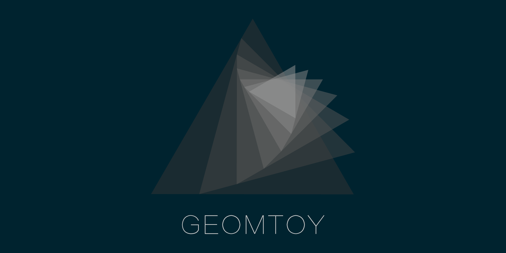

Geomtoy / [Modules](modules.md)

# Geomtoy



> A lightweight 2D geometric computing library

## Install

```js
npm i geomtoy -S
```

## API

### Classes

- [Point](./Point.md)

  

Line

Segment

Circle

Vector

### Transformation

## 关于坐标系和旋转角度的正负

`屏幕坐标系`是二维左手坐标系，下简称`左手系`，即 x 轴正方向逆时针旋转 90 度与 y 轴负方向同向，而`平面解析几何坐标系`是二维右手坐标系,下简称`右手系`，即 x 轴正方向逆时针旋转 90 度与 y 轴正方向同向。

数学中把沿逆时针方向旋转生成的角规定为正角，沿顺时针方向旋转生成的角则规定为负角。所有三角函数的实现都遵照这一规定。

这里面最重要的是为什么逆时针旋转的角度是正角？其实，更准确的是说，`从 x 轴正方向朝向 y 轴正方向的旋转生成的角度`叫正角，而对于`右手系`，它正好是逆时针的。所以正负角的规定，也是基于`右手系`的。

> 所以可以认为，Javascript 中，Math 的三角函数是按照`右手系`系来进行计算的。

如：点(1, 0)沿与 x 轴正方向呈逆时针旋转 Math.PI / 2 的角度（此时方向应指向屏幕正上方）前进 1 的距离，则计算出新的坐标是 (1 + Math.cos(Math.PI / 2), 0 + Math.sin(Math.PI / 2)) = (1, 1)。

很显然，按照`右手系`，这个点(1, 1)是正确的，但是按照`左手系`，点(1, 0)向上移动，y 坐标应该变小，我们期望的结果应该是(1, -1)。

如果我们按照(1 + Math.cos(-Math.PI / 2), 0 + Math.sin(-Math.PI / 2)) = (1, -1)。则符合期望。

（注：这其实并不冲突，因为对于`左手系`，它如果同样按照`从 x 轴正方向朝向 y 轴正方向的旋转生成的角度`来定义的话，顺时针方向的旋转角度才为正角。这也是很多其他绘图方式所采纳的。）

所以对于`左手系`，正负角关系与`右手系`正好相反。

为了让用户不会在使用时，对类似以上描述的情况产生困扰，在这个工具内部进行了角度的转换。旋转角度的正负完全按照`右手系`来定义。即在使用时，旋转角度就是按照通常理解的逆时针旋转为正角，顺时针旋转为负角。
