### Segments positional relationships

| id   | relationships            | same | perpendicular | parallel | jointed | collinear | overlapped | intersected |
| ---- | ------------------------ | ---- | ------------- | -------- | ------- | --------- | ---------- | ----------- |
| s1   | 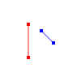   |      |               |          |         |           |            |             |
| s2   | 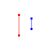   |      |               | true     |         |           |            |             |
| s3   | 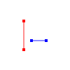   |      | true          |          |         |           |            |             |
| s4   | 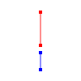   |      |               | true     |         | true      |            |             |
| s5   |    |      |               | true     | true    | true      |            |             |
| s6   | 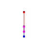   |      |               | true     |         | true      | true       |             |
| s7   | 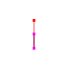   |      |               | true     | true    | true      | true       |             |
| s8   | 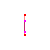   |      |               | true     |         | true      | true       |             |
| s9   |    | true |               | true     |         | true      | true       |             |
| s10  |  |      |               |          |         |           |            | true        |
| s11  | 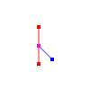 |      |               |          |         |           |            | true        |
| s12  | 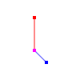 |      |               |          | true    |           |            | true        |
| s13  |  |      | true          |          |         |           |            | true        |
| s14  | 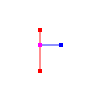 |      | true          |          |         |           |            | true        |
| s15  | 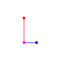 |      | true          |          | true    |           |            | true        |

All possible positional relationships between the segments are listed above, including parallel and perpendicular.
